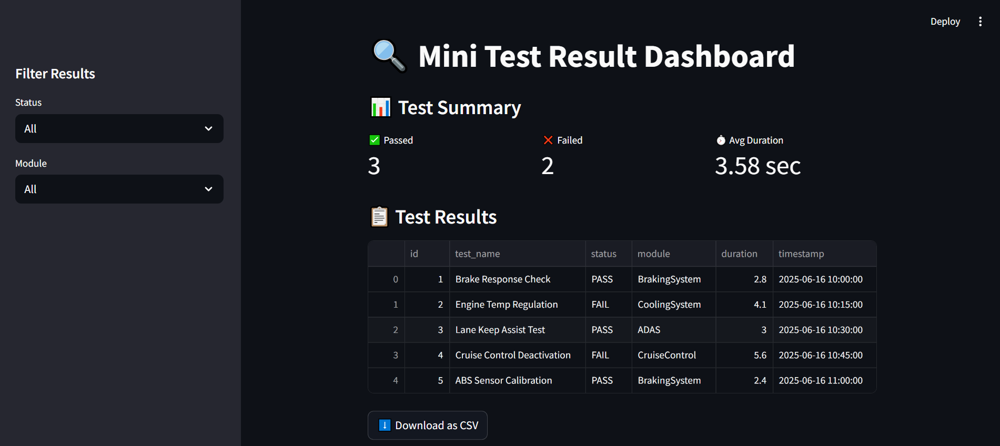

# 🧪 Mini-Test Result Dashboard

A beginner-friendly Python + SQL + Streamlit project inspired by TraceTronic's `test.guide`.  
This dashboard stores, filters, and displays automated test results in a web interface.

---

## 📸 Test Results Dashboard (UI)



---


## 🚀 Features

- Add and store test results in a SQLite database
- View total passed/failed tests
- Filter test results by status and module
- See average test duration
- Download filtered results as CSV

---


## 📦 Tech Stack

- Python 3.10
- SQLite
- Streamlit
- Pandas
- JSON

---

## 📁 Folder Structure

```bash
mini_test_dashboard/
├── app.py # Streamlit dashboard app
├── create_db.py # Creates database from schema
├── insert_data.py # Inserts sample test data
├── sample_data.json # Test data file (JSON)
├── schema.sql # SQL schema for database
├── test_data.db # SQLite database (auto-created)
└── README.md # Project documentation

```

## 🏁 How to Run

1. Clone the repo or download the code.
2. Create the database:

```bash
python create_db.py
```

3. Insert test data:
```bash
python insert_data.py
```


4. Run the dashboard:
```bash
streamlit run app.py
```


